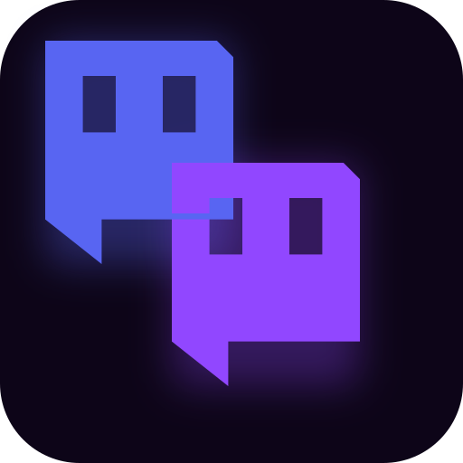

<p align="center"></p>

<h1 align="center">Collab Planner</h1>

<p align="center"><strong>Scheduling tool for video-streaming crews. Reads each member's broadcast history and auto-detects overlap windows so cross-channel collabs skip the calendar-tetris.</strong></p>

<p align="center">
  
  
  
  
  <a href="https://collab.deutschmark.online"></a>
</p>

---

## What it does

- **Broadcast-history overlap detection** — adds each friend's real VOD history to learn when they stream, then ranks time slots where the whole group is likely to be live at once.
- **Smart scheduling** — pattern analysis considers days, times, durations, and posted Twitch schedules to surface the best overlap windows.
- **Game suggestions** — shared play history surfaces games the selected group is most likely to enjoy together.
- **Friends system** — add Twitch streamers by username; their VOD history is fetched automatically via Twitch Helix.
- **Calendar** — visual calendar showing your own events alongside estimated stream times for all your friends.
- **Session facts & Discord drafts** — build a ready-to-paste Discord message and copy it with one click.
- **Reminders** — set browser notification reminders for upcoming collabs.

---

## Setup

### Prerequisites

- [Node.js](https://nodejs.org/) 18+
- A Supabase project with Postgres and Auth enabled
- A [Twitch Developer](https://dev.twitch.tv/console/apps) account (free)

### Install

```bash
git clone https://github.com/thedeutschmark/collab-planner.git
cd collab-planner
npm install
npx prisma generate
npx prisma migrate dev
npm run dev
```

Open [http://localhost:3000](http://localhost:3000) and sign in with Twitch.

### Environment variables

Configure everything on the in-app **Settings** page — no `.env` file required. Alternatively, set them in `.env.local` (see `.env.example`). Keys saved in Settings take priority over env vars.

| Variable | Where to get it | Purpose |
|---|---|---|
| `DATABASE_URL` / `DIRECT_URL` | Supabase project settings | Postgres connection for app data |
| `NEXT_PUBLIC_SUPABASE_URL` / `NEXT_PUBLIC_SUPABASE_PUBLISHABLE_KEY` | Supabase project settings | Authentication and session handling |
| `TWITCH_CLIENT_ID` / `TWITCH_CLIENT_SECRET` | [Twitch Developer Console](https://dev.twitch.tv/console/apps) | Streamer search, VOD history, schedules, game categories |

---

## How it works

1. **Add your Twitch username** in Settings — the app pulls your past broadcasts to learn your streaming patterns.
2. **Add friends** by username — their VOD history is fetched automatically via Helix.
3. **Plan a collab** — select friends, click "Suggest Times" for ranked overlap windows.
4. **Pick a game** — click "Suggest" for game recommendations based on shared play history.
5. **Send invites** — build a Discord message draft and copy it with one click.

The ranking considers actual stream history (days, times, durations, games played) and posted Twitch schedules where available; your own patterns are always included.

---

## Architecture

| Layer | Technology |
|---|---|
| Framework | Next.js 16 (App Router) + TypeScript |
| Database | Postgres via Prisma ORM |
| Auth | Supabase Auth (Twitch OAuth) |
| Styling | Tailwind CSS v4 + shadcn/ui |
| Twitch data | Twitch Helix API (search, VOD history, schedules, games) |
| Calendar | FullCalendar |
| Data fetching | SWR |

### Project structure

```
app/                    # Next.js pages and API routes
├── api/                # REST API endpoints
├── calendar/           # Calendar view
├── events/             # Create/view events
├── friends/            # Friends list and detail
├── messages/           # Redirects into session planning surfaces
└── settings/           # API key configuration
lib/
├── db.ts               # Prisma client singleton
├── twitch/             # Twitch API client, auth, VOD fetching
├── scheduling/         # Pattern analysis and overlap detection
└── discord/            # Message template builders
components/             # UI components (shadcn/ui)
hooks/                  # React hooks (reminders, clipboard)
prisma/                 # Database schema and migrations
```

---

## You might also like

Part of the [deutschmark](https://github.com/thedeutschmark) stream toolset — tools built to work together:

| Tool | What it is |
| --- | --- |
| **[The Stream Toolset](https://toolset.deutschmark.online)** | OBS overlays + companion apps. One login, no subscriptions. |
| **[Clipline](https://github.com/thedeutschmark/clipline)** | Turn livestream VODs into shortform clips with auto-captions. |

<sub>See everything → [github.com/thedeutschmark](https://github.com/thedeutschmark)</sub>

---

## License

MIT
